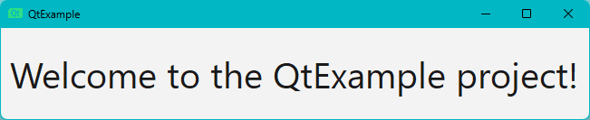

# QtExample

A simple example of a Qt6 project, built with Cmake.

## Requirements

 - Cmake v3.30.2
 - MSVC2019_64 (Windows)
 - Qt6 v6.7.2 (Windows)
 - Qt6 v6.2.4 (Linux)

## Installation

Windows:

1. [Install Cmake](https://cmake.org/download).

2. [Install Qt6 via Qt Online Installer](https://doc.qt.io/qt-6/qt-online-installation.html).
Also install MSVC2019_64 (Qt Maintenance Tool -> Add or remove components -> Qt -> Qt 6.7.2 -> MSVC 2019 64-bit).

3. Add the Qt6 install location to PATH:

    ```powershell
    $env:PATH = "C:\Qt\6.7.2\msvc2019_64\bin;$env:PATH"
    ```

Linux:

1. Install Cmake:

    ```bash
    sudo apt-get -y install cmake
    ```
  
2. Install gcc:

    ```bash
    sudo apt-get -y install build-essential
    ```

3. Install Qt6:

    ```bash
    sudo apt-get -y install libgl1-mesa-dev libglu1-mesa-dev freeglut3-dev mesa-common-dev qt6-base-dev qt6-base-dev-tools libxcb-cursor0 qt6-multimedia-dev
    ```

4. Install missing dependencies for XKB and Vulkan:

    ```bash
    sudo apt-get -y install libxkbcommon-dev libvulkan-dev libqt6svg6*
    ```

## Usage

Windows:

1. Clone the repository:

    ```powershell
    git clone https://github.com/callmebohdan/QtExample.git
    ```

2. Navigate to the project directory:

    ```powershell
    cd QtExample
    ```

3. Build and run the project:

    ```powershell
    .\scripts\build.bat
    ```

4. Clean the project:

    ```powershell
    .\scripts\clean.bat
    ```

Linux:

1. Clone the repository:

    ```bash
    git clone https://github.com/callmebohdan/QtExample.git
    ```

2. Navigate to the project directory:

    ```bash
    cd QtExample
    ```

3. Build and run the project:

    ```bash
    sh ./scripts/build.sh
    ```

4. Clean the project:

    ```bash
    sh ./scripts/clean.sh
    ```

5. To fix the **Warning: Ignoring XDG_SESSION_TYPE=wayland on Gnome. Use QT_QPA_PLATFORM=wayland to run on Wayland anyway** run:

    ```bash
    export QT_QPA_PLATFORM=xcb ; source ~/.bashrc
    ```

## Example

Run the application:

Windows:

```powershell
.\bin\QtExample.exe
```

Linux:

```bash
./bin/QtExample
```

You should see this window:


