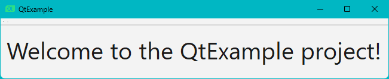

# QtExample

A simple example of a Qt6 project, built with Cmake.

## Requirements

 - Cmake v3.30.2
 - MinGW-w64 v4.4.1
 - Qt6 v6.7.2

## Installation

Windows:

1. Install [MinGW-w64 via MSYS2](https://code.visualstudio.com/docs/cpp/config-mingw).

2. Add the MinGW install location to PATH:

    ```powershell
    $env:PATH = "C:\msys64\ucrt64\bin;$env:PATH"
    ```

3. Install [Qt6](https://doc.qt.io/qt-6/qt-online-installation.html):

4. Add the Qt6 install location to  PATH:

    ```powershell
    $env:PATH = "C:\Qt\6.7.2\mingw_64\bin;$env:PATH"
    ```

5. Install [Cmake](https://cmake.org/download).

## Usage

Windows:

1. Clone the repository:

    ```powershell
    git clone https://github.com/callmebohdan/QtExample.git
    ```

2. Navigate to the project directory:

    ```powershell
    cd QtExample
    ```

3. Build and run the project:

    ```powershell
    .\scripts\build_and_run.bat
    ```

## Example

Run the application:

```powershell
.\build\QtExample.exe
```

You should see this window:



